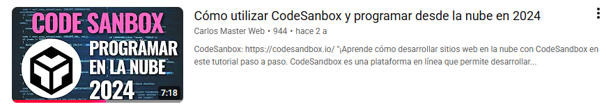

### Cómo crear y editar un sitio web básico usando HTML, CSS y JavaScript en CodeSandbox. También cómo compartir tu proyecto con otras personas y cómo publicarlo en línea. 

[Video Youtube](http://www.google.com)
